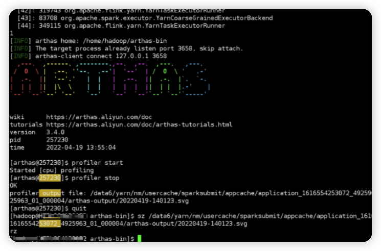

<!--
Licensed to the Apache Software Foundation (ASF) under one
or more contributor license agreements.  See the NOTICE file
distributed with this work for additional information
regarding copyright ownership.  The ASF licenses this file
to you under the Apache License, Version 2.0 (the
"License"); you may not use this file except in compliance
with the License.  You may obtain a copy of the License at

  http://www.apache.org/licenses/LICENSE-2.0

Unless required by applicable law or agreed to in writing,
software distributed under the License is distributed on an
"AS IS" BASIS, WITHOUT WARRANTIES OR CONDITIONS OF ANY
KIND, either express or implied.  See the License for the
specific language governing permissions and limitations
under the License.
-->

# Fire框架

　　Fire框架是由**中通大数据**自主研发并开源的、专门用于进行**Spark**和**Flink**任务开发的大数据框架。该框架屏蔽技术细节，提供大量简易API帮助开发者更快的构建实时计算任务。同时Fire框架也内置了平台化的功能，用于与实时平台集成。基于Fire框架的任务在中通每天处理的数据量高达**几千亿以上**，覆盖了**Spark计算**（离线&实时）、**Flink计算**等众多计算场景。

## 一、就这么简单！

### 1.1 Flink开发示例

```scala
@Config(
  """
    |state.checkpoints.num-retained=30 	# 支持任意Flink调优参数、Fire框架参数、用户自定义参数等
    |state.checkpoints.dir=hdfs:///user/flink/checkpoint
    |""")
@Hive("thrift://localhost:9083") // 配置连接到指定的hive
@Streaming(interval = 100, unaligned = true) // 100s做一次checkpoint，开启非对齐checkpoint
@Kafka(brokers = "localhost:9092", topics = "fire", groupId = "fire")
object FlinkDemo extends FlinkStreaming {

  @Process
  def kafkaSource: Unit = {
    val dstream = this.fire.createKafkaDirectStream() 	// 使用api的方式消费kafka
    sql("""create table statement ...""")
    sql("""insert into statement ...""")
  }
}
```

### 1.2 Spark开发示例

```scala
@Config(
  """
    |spark.shuffle.compress=true		# 支持任意Spark调优参数、Fire框架参数、用户自定义参数等
    |spark.ui.enabled=true
    |""")
@Hive("thrift://localhost:9083") // 配置连接到指定的hive
@Streaming(interval = 100, maxRatePerPartition = 100) // 100s一个Streaming batch，并限制消费速率
@Kafka(brokers = "localhost:9092", topics = "fire", groupId = "fire")
object SparkDemo extends SparkStreaming {

  @Process
  def kafkaSource: Unit = {
    val dstream = this.fire.createKafkaDirectStream() 	// 使用api的方式消费kafka
    sql("""select * from xxx""").show()
  }
}
```

***说明：structured streaming、spark core、flink sql、flink批任务均支持，代码结构与上述示例一致。***

## *[二、开发文档](./docs/index.md)*

## 三、亮点多多！

### 3.1 兼容主流版本

　　fire框架适配了不同的spark与flink版本，支持spark2.x及以上所有版本，flink1.10及以上所有版本，支持基于scala2.11或scala2.12进行编译。

```shell
# 可根据实际需要选择不同的引擎版本进行fire框架的构建
mvn clean install -DskipTests -Pspark-3.0.2 -Pflink-1.14.3 -Pscala-2.12
```

| Apache Spark | Apache Flink |
| ------------ | ------------ |
| 2.3.x        | 1.10.x       |
| 2.4.x        | 1.11.x       |
| 3.0.x        | 1.12.x       |
| 3.1.x        | 1.13.x       |
| 3.2.x        | 1.14.x       |
| 3.3.x        | 1.15.x       |

### **3.2 简单好用**

　　Fire框架高度封装，屏蔽大量技术细节，许多connector仅需一行代码即可完成主要功能。同时Fire框架统一了spark与flink两大引擎常用的api，使用统一的代码风格即可实现spark与flink的代码开发。

- **HBase API**

```scala
// 读取HBase中指定rowkey数据并将结果集封装为DataFrame返回
val studentDF: DataFrame = this.fire.hbaseGetDF(hTableName, classOf[Student], getRDD)
// 将指定数据集分布式插入到指定HBase表中
this.fire.hbasePutDF(hTableName, studentDF, classOf[Student])
```

- **JDBC API**

```scala
// 将DataFrame中指定几列插入到关系型数据库中，每100条一插入
df.jdbcBatchUpdate(insertSql, Seq("name", "age", "createTime", "length", "sex"), batch = 100)
// 将查询结果通过反射映射到DataFrame中
val df: DataFrame = this.fire.jdbcQueryDF(querySql, Seq(1, 2, 3), classOf[Student])
```

### **3.3 灵活的配置方式**

　　支持基于接口、apollo、配置文件以及注解等多种方式配置，支持将spark&flink等**引擎参数**、**fire框架参数**以及**用户自定义参数**混合配置，支持运行时动态修改配置。几种常用配置方式如下（[配置手册](./docs/config.md)）：

1. **基于配置文件：** 创建类名同名的properties文件进行参数配置
2. **基于接口配置：** fire框架提供了配置接口调用，通过接口获取所需的配置，可用于平台化的配置管理
3. **基于注解配置：** 通过注解的方式实现集群环境、connector、调优参数的配置，常用注解如下：

```scala
@Config(
  """
    |# 支持Flink调优参数、Fire框架参数、用户自定义参数等
    |state.checkpoints.num-retained=30
    |state.checkpoints.dir=hdfs:///user/flink/checkpoint
    |""")
@Hive("thrift://localhost:9083")
@Checkpoint(interval = 100, unaligned = true)
@Kafka(brokers = "localhost:9092", topics = "fire", groupId = "fire")
@RocketMQ(brokers = "bigdata_test", topics = "fire", groupId = "fire", tag = "*", startingOffset = "latest")
@Jdbc(url = "jdbc:mysql://mysql-server:3306/fire", username = "root", password = "..root726")
@HBase("localhost:2181")
```

**配置获取：**

　　Fire框架封装了统一的配置获取api，基于该api，无论是spark还是flink，无论是在Driver | JobManager端还是在Executor | TaskManager端，都可以一行代码获取所需配置。这套配置获取api，无需再在flink的map等算子中复写open方法了，用起来十分方便。

```scala
this.conf.getString("my.conf")
this.conf.getInt("state.checkpoints.num-retained")
...
```

### **3.4 多集群支持**

　　Fire框架的配置支持N多集群，比如同一个任务中可以同时配置多个HBase、Kafka数据源，使用不同的数值后缀即可区分（**keyNum**）：

```scala
// 假设基于注解配置HBase多集群如下：
@HBase("localhost:2181")
@HBase2(cluster = "192.168.0.1:2181", storageLevel = "DISK_ONLY")

// 代码中使用对应的数值后缀进行区分
this.fire.hbasePutDF(hTableName, studentDF, classOf[Student])	// 默认keyNum=1,表示使用@HBase注解配置的集群信息
this.fire.hbasePutDF(hTableName2, studentDF, classOf[Student], keyNum=2)	// keyNum=2，表示使用@HBase2注解配置的集群信息
```

### **3.5 常用connector支持**

　　支持kafka、rocketmq、redis、HBase、Jdbc、clickhouse、Hive、hudi、tidb、adb等常见的connector。

### **3.6 [checkpoint热修改](./docs/highlight/checkpoint.md)**

　　支持运行时动态调整checkpoint周期、超时时间、并行checkpoint等参数，避免任务重启时由于反压带来的checkpoint压力。

### **3.7 [streaming热重启](./docs/highlight/spark-duration.md)**

　　该功能是主要用于Spark Streaming任务，通过热重启技术，可以在不重启Spark Streaming的前提下，实现批次时间的热修改。比如在web端将某个任务的批次时间调整为10s，会立即生效。

### **3.8 配置热更新**

　　用户仅需在web页面中更新指定的配置信息，就可以让实时任务接收到最新的配置并且立即生效。最典型的应用场景是进行Spark任务的某个算子partition数调整，比如当任务处理的数据量较大时，可以通过该功能将repartition的具体分区数调大，会立即生效。

### **3.9 在线性能诊断**

　　深度集成Arthas，可对运行中的任务动态进行性能诊断。fire为arthas诊断提供rest接口，可通过接口调用的方式选择为driver、jobmanager或executor、taskmanager动态开启与关闭arthas诊断线程，然后向统一的arthas tunnel服务注册，即可在网页端输入arthas命令进行性能诊断。



### **3.10 sql在线调试**

　　Fire框架对外暴露了restful接口，平台等系统可通过接口调用的方式将待执行的sql语句动态传递给fire，由fire将sql提交到对应的引擎，并将sql执行结果通过接口调用的方式返回，实现实时任务sql开发的在线调试，避免重复修改代码发布执行带来的时间成本。

### **3.11 实时血缘**

　　Fire框架支持运行时统计分析每个任务所使用到的数据源信息、库表信息、操作类型等，并将这些血缘信息通过接口的方式对外暴露。实时平台等web系统通过接口调用的方式即可获取到实时血缘信息。

### **3.12 定时调度**

　　Fire框架内部封装了quartz框架，实现通过Scheduled注解即可完成定时任务的注册。

```scala
  /**
   * 声明了@Scheduled注解的方法是定时任务方法，会周期性执行
   *
   * @scope 默认同时在driver端和executor端执行，如果指定了driver，则只在driver端定时执行
   * @initialDelay 延迟多长时间开始执行第一次定时任务
   */
  @Scheduled(cron = "0/5 * * * * ?", scope = "driver", initialDelay = 60000)
  def loadTable: Unit = {
    this.logger.info("更新维表动作")
  }
```

### **3.13 平台无缝集成**

　　Fire框架内置restful服务，并将许多功能通过接口的方式对外暴露，实时平台可以通过fire框架暴露的接口实现与每个实时任务的信息连接。

### **3.14 fire-shell**

　　Fire框架整合spark shell与flink shell，支持通过REPL方式去动态调试spark和flink任务，并且支持fire框架的所有API。fire框架将shell能力通过接口方式暴露给实时平台，如此一来就可以通过web页面去调试spark和flink任务了。

## *[四、升级日志](./docs/feature.md)*

## 五、期待你的加入

**技术交流（钉钉群）：*35373471***


