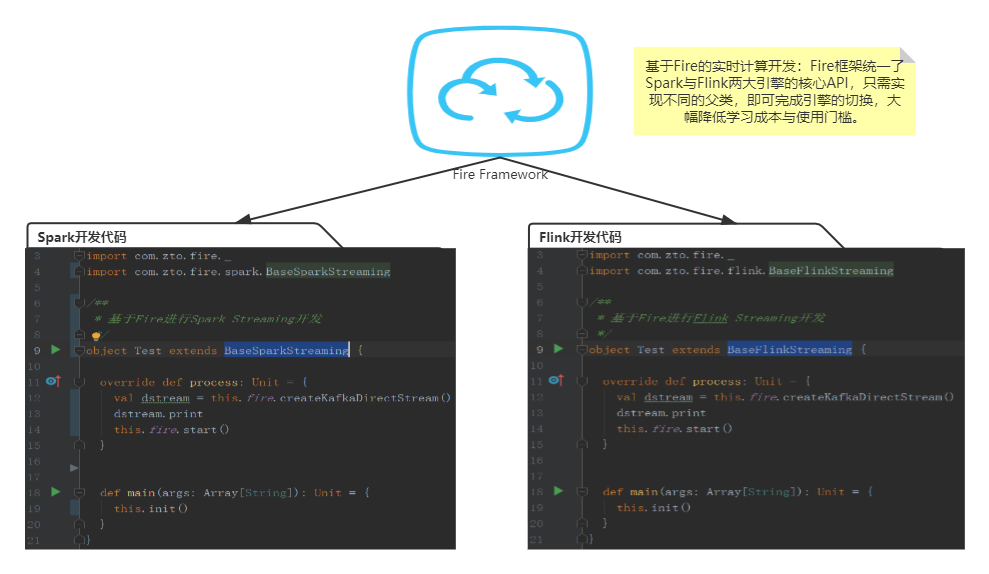

# Fire框架
Fire框架是由**中通**开源的，专门用于大数据**实时计算**的开发框架。Fire框架具有易学易用，稳定可靠等诸多优点，基于Fire框架可以很简单的进行**Spark&Flink**需求开发。Fire框架在赋能开发者的同时，也对实时平台进行了赋能，正因为有了Fire，才真正的连接了**平台**与**任务**，消除了任务孤岛。



## 一、现状
基于Fire框架的任务在中通每天处理的数据量高达**几千亿以上**，覆盖了**Spark计算**（离线&实时）、**Flink计算**等众多计算场景。
## 二、赋能开发者
Fire框架自研发之日起就以简单高效、稳定可靠为目标。通过屏蔽技术细节、提供简洁通用的API的方式，将开发者从技术的大海中拯救出来，让开发者更专注于业务代码开发。Fire框架支持Spark与Flink两大引擎，并且覆盖离线计算与实时计算两大场景，内部提供了丰富的API，许多复杂操作仅需一行代码，大大提升了生产力。

接下来以HBase、JDBC、Kafka为例进行简单介绍（connector连接信息均在任务同名的配置文件中）：

### 2.1 HBase 操作

```scala
val hTableName = "t_student"
/** HBase get API **/
// 构建rowKeyRDD
val rowKeyRDD: RDD[String] = this.fire.createRDD(getList, 3)
// 方式一：通过fire变量，批量get到的结果以dataframe形式返回，也支持返回RDD[JavaBean]或Dataset类型
val studentDF: DataFrame = this.fire.hbaseGetDF(hTableName, classOf[Student], getRDD)
// 方式二：通过RDD[String]对象直接get
val studentDS: Dataset[Student] = rowKeyRDD.hbaseGetDS(hTableName, classOf[Student])
// 方式三：通过bulk api进行HBase读操作
val studentDS: Dataset[Student] = rowKeyRdd.hbaseBulkGetDS(hTableName, classOf[Student])

/** HBase insert API **/
val studentDF: DataFrame = this.fire.createDataFrame(studentList, classOf[Student])
// 方式一：通过fire变量，将指定DataFrame数据插入到HBase中
this.fire.hbasePutDF(hTableName, studentDF, classOf[Student])
// 方式二：直接在DataFrame上调用hbasePutDF方法进行HBase写操作
studentDF.hbasePutDF(hTableName, classOf[Student])
// 方式三：通过bulk api进行HBase写操作
studentDF.hbaseBulkPutDF(hTableName, classOf[Student])

/** 多HBase集群操作 **/
studentDF.hbaseBulkPutDF(hTableName, classOf[Student], keyNum = 2)
```

### 2.2 JDBC 操作

```scala
/** 关系型数据库更新API **/
// 关系型数据库SQL语句
val insertSql = s"INSERT INTO table_name(name, age, createTime, length, sex) VALUES (?, ?, ?, ?, ?)"
// 将DataFrame中指定几列插入到关系型数据库中，每100条一插入
df.jdbcBatchUpdate(insertSql, Seq("name", "age", "createTime", "length", "sex"), batch = 100)

/** 关系型数据库查询API **/
val querySql = s"select * from $tableName where id in (?, ?, ?)"
// 将查询结果通过反射映射到DataFrame中
val df: DataFrame = this.fire.jdbcQueryDF(querySql, Seq(1, 2, 3), classOf[Student])

/** 多关系型数据库操作 **/
val df = this.fire.jdbcQueryDF(querySql, Seq(1, 2, 3), classOf[Student], keyNum=2)
```
###2.3 Kafka 操作

````scala
// 从指定kafka集群消费，该写法支持spark与flink，kafka相关信息在类同名的配置文件中
val dstream = this.fire.createKafkaDirectStream()
// 通过keyNum指定多kafka集群消费
val dstream = this.fire.createKafkaDirectStream(keyNum = 2)
````

可以看到，Fire框架中的API是以DataFrame、RDD为基础进行了高度抽象，通过引入fire隐式转换，让RDD、DataFrame等对象直接具有了某些能力，进而实现直接调用。目前Fire框架已经覆盖了主流大数据组件的API，基本上都是一行代码搞定。同时，Fire框架让任务具有**多集群的操作能力**，仅需在各API中指定参数**keyNum**，即可同时访问不同集群的不同表。

## 三、赋能平台
Fire框架可以将**实时任务**与**实时管理平台**进行绑定，实现很多酷炫又实用的功能。比如配置管理、SQL在线调试、任务热重启、配置热更新等，甚至可以直接获取到任务的运行时数据，实现更细粒度的监控管理。

### 3.1 配置管理

类似于携程开源的apollo，实时任务管理平台可提供任务配置的管理功能，基于Fire的实时任务在启动时会主动拉取配置信息，并覆盖任务jar包中的配置文件，避免重复打包发布，节约时间。

### 3.2 SQL在线调试

基于该技术，可以在实时任务管理平台中提交SQL语句，交由指定的Spark Streaming任务执行，并将结果返回，该功能的好处是支持Spark内存临时表，便于在web端进行Spark SQL的调试，大幅节省SQL开发时间。

### 3.3 定时任务

有些实时任务会有定时刷新维表的需求，Fire框架支持这样的功能，类似于Spring的@Scheduled，但Fire框架的定时任务功能更强大，甚至支持指定在driver端运行还是在executor端运行。

```scala
/**
 * 声明了@Scheduled注解的方法将作为定时任务方法，会被Fire框架周期性调用
 *
 * @param cron cron表达式
 * @param scope 默认同时在driver端和executor端执行，如果指定了driver，则只在driver端定时执行
 * @param concurrent 上一个周期定时任务未执行完成时是否允许下一个周期任务开始执行
 * @param startAt 用于指定第一次开始执行的时间
 * @param initialDelay 延迟多长时间开始执行第一次定时任务
 */
@Scheduled(cron = "0/5 * * * * ?", scope = "driver", concurrent = false, startAt = "2021-01-21 11:30:00", initialDelay = 60000)
def loadTable: Unit = {
  this.logger.info("周期性执行")
}
```

### 3.4 任务热重启

该功能是主要用于Spark Streaming任务，通过热重启技术，可以在不重启Spark Streaming的前提下，实现批次时间的热修改。比如在web端将某个任务的批次时间调整为10s，会立即生效。

### 3.5 配置热更新

用户仅需在web页面中更新指定的配置信息，就可以让实时任务接收到最新的配置并且立即生效。最典型的应用场景是进行Spark任务的某个算子partition数调整，比如当任务处理的数据量较大时，可以通过该功能将repartition的具体分区数调大，会立即生效。

### 3.6 实时血缘

基于Fire框架，可获取到任务所使用到的组件信息，包括任务使用到的hive表信息、hbase集群信息、jdbc信息等，可用于实时平台进行实时血缘的构建。

### 3.7 RocketMQ支持

Fire框架内部集成了rocketmq，甚至率先支持了flink sql任务的sql connector。

## 四、程序结构
​		Fire支持Spark与Flink两大热门计算引擎，对常用的初始化操作进行了大幅度的简化，让业务代码更紧凑更突出更具维护性。

###4.1 Spark开发

```scala
import com.zto.fire._
import com.zto.fire.spark.BaseSparkStreaming

/**
 * 基于Fire进行Spark Streaming开发
 */
object Test extends BaseSparkStreaming {

  /**
   * process会被fire框架主动调用
   * 在该方法中编写主要的业务代码，避免main方法过于臃肿
   */
  override def process: Unit = {
    // 从配置文件中获取kafka集群信息，并创建KafkaDataStram
    val dstream = this.fire.createKafkaDirectStream()
    dstream.print
    // 提交streaming任务执行
    this.fire.start
  }

  def main(args: Array[String]): Unit = {
    // 从配置文件中获取必要的配置信息，并初始化SparkSession、StreamingContext等对象
    this.init(10, false)
  }
}
```

###4.2 Flink开发
```scala
import com.zto.fire._
import com.zto.fire.flink.BaseFlinkStreaming

/**
 * Flink流式计算任务模板
 */
object Test extends BaseFlinkStreaming {

  override def process: Unit = {
    val dstream = this.fire.createKafkaDirectStream()
    dstream.print
    // 提交flink streaming任务，job名称不指定默认当前类名
    this.fire.start
  }

  def main(args: Array[String]): Unit = {
    // 根据配置信息自动创建fire变量、StreamExecutionEnvironment、StreamTableEnvironment等
    this.init()
  }
}
```

## 五、操作手册

### [5.1 依赖管理](docs/dependency.md)

### [5.2 第三方包install](docs/dependency-install.md)

### [5.3 Fire集成](docs/outline.md)

### [5.4 配置文件](docs/config.md)

### [5.5 消费Kafka](/docs/kafka.md)

### [5.6 消费RocketMQ](docs/rocketmq.md)

### [5.7 集成Hive](docs/hive.md)

### [5.8 HBase API手册](docs/hbase.md)

### [5.9 JDBC API手册](docs/jdbc.md)

### [5.10 累加器](docs/accumulator.md)

### [5.11 定时任务](docs/schedule.md)

### [5.12 线程池与并发计算](docs/threadpool.md)

### [5.13 Spark DataSource增强](docs/datasource.md)

## 六、平台建设

### [6.1 实时平台集成方案](docs/platform.md)

### [6.2 内置接口](docs/restful.md)

## 七、配置与调优

### [7.1 Fire配置手册](docs/properties.md)

