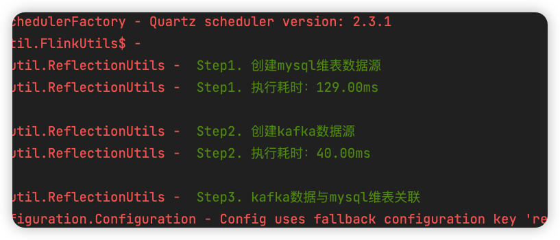

# Fire框架--基于注解简化Flink和Spark开发

　　从JDK5开始，Java提供了**注解**新特性，随后，注解如雨后春笋般被大量应用到各种开发框架中，其中，最具代表的是Spring。在注解出现以前，Spring的配置通常需要写到xml中。基于xml配置，有着十分繁琐，难以记忆，容易出错等弊端。Spring开发者也意识到了这个问题，于是开始引入大量的注解，让注解替代传统的xml配置。

　　到了大数据时代，以Hadoop、Spark、Flink为代表的分布式计算引擎先后横空出世。相信很多从事过Java Web开发工作的人一开始都不太习惯这几款开发框架提供的API，这几款框架也不约而同的放弃注解特性。可能很多大数据开发者都或多或少的设想，将Spring集成到Spark或者Flink的代码工程中，但这么做实际是有很多问题的，因为Spring并不适用于大数据分布式计算场景。

　　**那么，实时开发的Spring（春天）在哪里呢？就在Fire框架中！**为了最大化降低实时计算开发门槛，节约代码量，提高配置的便捷性，**中通快递大数据团队**自研了**Fire框架**。Fire框架在中通内部深耕多年，目前线上**数千个**任务均是基于Fire框架开发的。基于Fire框架的任务每天处理的数据量高达**几千亿规模**，顺利通过一年又一年的双十一大考。Fire框架**开源免费**，同时支持**Spark**与**Flink**两大主流引擎，有着简洁方便极易入门等优点，只需几分钟，即可学会。

## 一、快速入门案例

### 1.1 Flink开发示例

```scala
@Streaming(interval = 100, unaligned = true, parallelism = 4) // 100s做一次checkpoint，开启非对齐checkpoint
@Kafka(brokers = "localhost:9092", topics = "fire", groupId = "fire")
object FlinkDemo extends FlinkStreaming {

  @Process
  def kafkaSource: Unit = {
    val dstream = this.fire.createKafkaDirectStream() 	// 使用api的方式消费kafka
    sql("""create table statement ...""")
    sql("""insert into statement ...""")
  }
}
```

### 1.2 Spark开发示例

```scala
@Config(
  """
    |# 支持Spark、Flink引擎调优参数、Fire框架参数、用户自定义参数等
    |spark.shuffle.compress=true
    |spark.ui.enabled=true
    |""")
@Hive("thrift://localhost:9083") // 配置连接到指定的hive
@Streaming(interval = 100, maxRatePerPartition = 100) // 100s一个Streaming batch，并限制消费速率
@Kafka(brokers = "localhost:9092", topics = "fire", groupId = "fire")
object SparkDemo extends SparkStreaming {

  @Process
  def kafkaSource: Unit = {
    val dstream = this.fire.createKafkaDirectStream() 	// 使用api的方式消费kafka
    sql("""select * from xxx""").show()
  }
}
```

　　通过上述两个代码示例可以看出，Fire框架为Spark和Flink开发提供了统一的编程风格，使用Fire提供的注解以及对应的父类，即可完成框架的集成。示例中的**@Config**注解支持多行配置，支持Spark或Flink的调优参数、Fire框架内置参数以及用户自定义参数。当任务执行起来时，Fire框架会根据这些配置信息，去初始化**SparkSession**或**ExecutionEnvironment**等上下文信息，避免了大量冗余的任务初始化代码。当然，@Config注解不是必须的，如果不指定，Fire框架会以默认最优的参数去初始化引擎上下文对象。**@Process**注解用于标记开发者代码逻辑的入口，标记该注解的方法会被FIre框架自动调用。mian方法也不是必须的，因为它被定义在了父类当中。

　　**@Streaming**注解同时适用于Spark Streaming以及Flink两大计算引擎，**interval**用于设置Spark Streaming的批次时间，或者是Flink的**checkpoint**间隔时间。**parallelism**用于指定Flink任务的全局并行度，maxRatePerPartition则是用于配置Spark Streaming的消费速率。@Streaming注解还有很多功能，包括开启checkpoint超时时间、是否开启非对齐checkpoint、Spark Streaming允许同时执行的批次数等。

　　**@Hive**注解用于指定hive metastore的url，适用于Spark和Flink。当指定了@Hive注解时，Fire框架在内部初始化时即可完成Spark与Flink创建hive catalog的动作。无需将hive-site.xml放到resources目录下，也不需要将hive相关的conf信息手动设置到SparkSession或ExecutionEnvironment中。

　　**@Kafka**和**@RocketMQ**注解用于配置消费消息队列相关的信息，指定好以后，在代码中即可完成一行代码接入：

```scala
val dstream = this.fire.createKafkaDirectStream() 	// 使用api的方式消费kafka
val dStream = this.fire.createRocketMqPullStream()  // 使用api的方式消费rocketmq
```

### 1.3 SQL开发示例

　　Fire框架对纯SQL开发也提供了很简洁的API，在开发中，将SQL语句（多条以分号分割）放到**sql()**方法中，然后在方法上标记**@Step**注解，即可被顺序执行。@Step注解中的中文描述，会被Fire框架自动打印到日志中，便于问题跟踪、异常排查等。当然，@Step注解和sql()方法一样可以应用到纯api开发的代码中，这些都是通用的。

```scala
@Streaming(interval = 60, parallelism = 2)
object JdbcDimDemo extends FlinkStreaming {

  @Step1("数据源定义")
  def ddl: Unit = {
    sql(
      """
        |CREATE TABLE t_mysql_dim (
        |  `id` BIGINT ...
        |) WITH ( ...
        |);
        |
        |CREATE TABLE t_kafka_fire (
        |  `id` BIGINT...
        |) WITH ( ...
        |)
        |""".stripMargin)
  }

  @Step2("kafka数据与mysql维表关联")
  def showJoin: Unit = {
    sql(
      """
        |select
        | xxx
        |from t_kafka_fire t1 left join t_mysql_dim  t2 on t1.id=t2.id
        |""".stripMargin).print()
  }
}

```

上述代码，Fire框架会根据代码中**@Step**注解的顺序，依次执行代码逻辑，并在日志中打印类似于下图的信息：



## 二、注解含义（Spark与Flink通用）

- **@Config：**该注解支持Flink、Spark引擎相关参数、Fire框架参数以及用户自定义参数。对于引擎相关配置信息，会在构建**SparkSession**或Flink **ExecutionEnvironment**时自动设置生效，避免编写大量重复的用于构建引擎上文的代码。
- **@Streaming：**该注解支持Flink的Checkpoint相关参数，包括频率、超时时间等，还可以进行任务并发度的配置。而对于Spark Streaming任务，则用于设置批次时间、是否开启反压，以及反压情况下消费速率等参数。
- **@Kafka：**该注解用于配置任务中使用到的kafka集群信息，以及kafka-client相关调优参数。如果任务中消费多个kafka，可以使用@Kafka2、@Kafka3这种写法。
- **@Hive：**该注解用于指定任务中所使用的hive数仓thrift server地址。支持HDFS HA，支持跨集群读写Hive。
- **@Process：**该注解用于标记用户代码的入口，标记了@Process的方法会被Fire框架自动调起。
- **@HBase**：用于配置HBase相关连接信息，一行代码完成HBase的读写。

```scala
// 假设基于注解配置HBase多集群如下：
@HBase("localhost:2181")
@HBase2(cluster = "192.168.0.1:2181", storageLevel = "DISK_ONLY")

// 代码中使用对应的数值后缀进行区分
this.fire.hbasePutDF(hTableName, studentDF, classOf[Student])	// 默认keyNum=1,表示使用@HBase注解配置的集群信息
this.fire.hbasePutDF(hTableName2, studentDF, classOf[Student], keyNum=2)	// keyNum=2，表示使用@HBase2注解配置的集群信息
```

- **@JDBC**：用于配置jdbc相关信息，Fire框架内部封装了数据库连接池，会自动获取该注解的配置信息。

```scala
@Jdbc(url = "jdbc:derby:memory:fire;create=true", username = "fire", password = "fire")
val insertSql = s"INSERT INTO $tableName (name, age, createTime, length, sex) VALUES (?, ?, ?, ?, ?)"
this.fire.jdbcUpdate(insertSql, Seq("admin", 12, timestamp, 10.0, 1))
```

- **@Scheduled**：用法类似于Sping，支持在Spark Streaming或Flink任务中执行周期性任务。

```scala
/**
  * 声明了@Scheduled注解的方法是定时任务方法，会周期性执行
  *
  * @scope 默认同时在driver端和executor端执行，如果指定了driver，则只在driver端定时执行
  * @initialDelay 延迟多长时间开始执行第一次定时任务
  */
@Scheduled(cron = "0/5 * * * * ?", scope = "driver", initialDelay = 60000)
def loadTable: Unit = {
  this.logger.info("更新维表动作")
}
```

- **@Before：**生命周期注解，用于在Fire框架初始化引擎上下文之前调用。
- **@After：**生命周期注解，用于在Fire退出jvm之前调用，可用于Spark批任务回收数据库连接池等对象。

## 三、参考文章：

- ### [Fire框架--快速的进行Spark与Flink开发](https://zhuanlan.zhihu.com/p/540808612)

- ### [Fire框架--Flink Checkpoint运行时动态调优](https://zhuanlan.zhihu.com/p/551394441)

- ### [Fire框架--Spark Streaming动态调整批次时间](https://zhuanlan.zhihu.com/p/552848864)

- ### [Fire框架--Flink参数调优与参数获取](https://zhuanlan.zhihu.com/p/543184683)

- ### [Fire框架--优雅的实现Flink定时任务](https://zhuanlan.zhihu.com/p/541358069)

## 四、Fire框架源码地址

- ### GitHub：https://github.com/ZTO-Express/fire

- ### Gitee：https://gitee.com/RS131419/fire

## 五、Fire框架社区交流群

### **技术交流（钉钉群）：*35373471***

