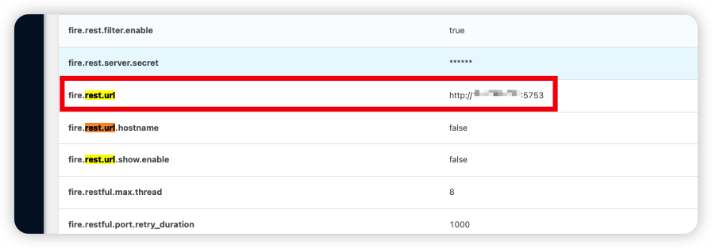
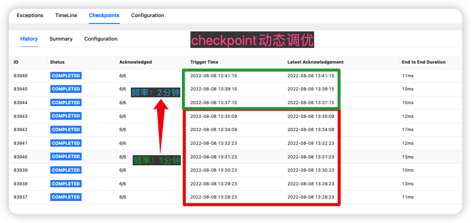

<!--
Licensed to the Apache Software Foundation (ASF) under one
or more contributor license agreements.  See the NOTICE file
distributed with this work for additional information
regarding copyright ownership.  The ASF licenses this file
to you under the Apache License, Version 2.0 (the
"License"); you may not use this file except in compliance
with the License.  You may obtain a copy of the License at

  http://www.apache.org/licenses/LICENSE-2.0

Unless required by applicable law or agreed to in writing,
software distributed under the License is distributed on an
"AS IS" BASIS, WITHOUT WARRANTIES OR CONDITIONS OF ANY
KIND, either express or implied.  See the License for the
specific language governing permissions and limitations
under the License.
-->

# Flink Checkpoint动态调优

　　Flink作为有状态的流式计算引擎，周期性的checkpoint至关重要。checkpoint的周期不宜设置过长或过短，针对不同的任务要区别对待。甚至针对同一个任务，在不同场景下checkpoint过程也会因为**超时**或**反压**等原因导致失败。下面先来看一下传统checkpoint调优所面临的问题：

## 一、传统checkpoint调优痛点

　　Flink checkpoint**速率**、频率、**超时时间**参数等直接影响了任务的健康度。当flink任务重启时，会因消息积压导致任务反压，任务反压反过来会促使checkpoint变慢甚至是超时。如此一来，仿佛进入了一个恶性循环。

- **静态调整**：flink任务的checkpoint相关参数，必须在任务运行前提前设置好，运行时是没办法动态调整的
- **影响数据时效**：重启任务调整checkpoint，必然带来消息处理的延迟，对于实时性要求非常高的场景，影响很大
- **加剧反压**：重启任务后，会带来数据消费的滞后性，如果任务本身checkpoint耗时比较长，还会因为反压与同时做checkpoint带来性能进一步的恶化

## 二、基于Fire实现动态调优

　　Fire框架为Flink checkpoint提供了增强，可以做到运行时动态调整checkpoint的相关参数，达到不重启任务即可实现动态调优的目的。Flink开发者只需集成[集成Fire框架]([ZTO-Express/fire (github.com)](https://github.com/ZTO-Express/fire)) ，就可以在运行时通过调用Fire框架提供的restful接口，从而实现动态调整checkpoint参数的目的了。

## 三、典型场景

- **大状态任务**

　　假设线上有这样一个任务，每秒钟处理的消息量非常大，状态非常大，每次checkpoint耗时在5分钟以上。这个任务如果停止10分钟以上，会导致大量的消息积压，而消息积压导致的反压叠加checkpoint，会进一步影响任务的性能。这个时候，可以临时先将checkpoint周期调大，等反压结束后再调整回之前的checkpoint周期，降低了checkpoint耗时较长带来性能下降的影响。

- **临时调整**

​		不愿停止任务，只是临时性的调整checkpoint周期、超时参数等。

## 四、集成示例

```scala
@Checkpoint(interval = 100, unaligned = true) // 100s做一次checkpoint，开启非对齐checkpoint
@Kafka(brokers = "localhost:9092", topics = "fire", groupId = "fire")
object Demo extends BaseFlinkStreaming {

  override def process: Unit = {
    val dstream = this.fire.createKafkaDirectStream()	// 使用api的方式消费kafka
    this.fire.sql("""create table statement ...""")
    this.fire.sql("""insert into statement ...""")
    this.fire.start
  }
}
```

## 五、动态调整checkpoint参数

集成了Fire框架的flink任务在运行起来以后，可以在flink的webui的Job Manager -> Configuration中查看到restful接口地址：



找到接口地址以后，通过curl命令调用该接口即可实现动态调优：

```shell
curl -H "Content-Type:application/json" -X POST --data '{"interval":60000,"minPauseBetween": 60000, "timeout": 60000}' http://ip:5753/system/checkpoint
```

效果如下图所示：


