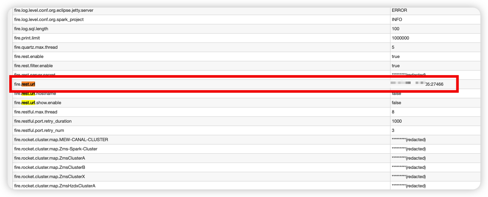

<!--
Licensed to the Apache Software Foundation (ASF) under one
or more contributor license agreements.  See the NOTICE file
distributed with this work for additional information
regarding copyright ownership.  The ASF licenses this file
to you under the Apache License, Version 2.0 (the
"License"); you may not use this file except in compliance
with the License.  You may obtain a copy of the License at

  http://www.apache.org/licenses/LICENSE-2.0

Unless required by applicable law or agreed to in writing,
software distributed under the License is distributed on an
"AS IS" BASIS, WITHOUT WARRANTIES OR CONDITIONS OF ANY
KIND, either express or implied.  See the License for the
specific language governing permissions and limitations
under the License.
-->

# Spark Streaming动态调整批次时间

　　Spark Streaming作为微批次流式计算引擎，批次的间隔时间可能是最常被调整和使用的参数之一。批次的间隔较小，实效性较好，但吞吐性能会下降。批次的间隔时间较大，实效性较差，但吞吐性能会提高很多。

## 一、传统Streaming批次时间调整痛点

　　对于传统的Spark Streaming批次间隔时间调整，一般来说需要修改代码，重启Spark任务。这种方式比较麻烦，灵活性很差，没办法灵活的应对不同的生产场景。比如说电商大促期间，消息量可能是平日里的3倍以上，这个时候往往需要临时调大计算资源或调大Streaming的批次间隔时间来提高吞吐率。如果任务少还好，任务很多的情况下，就显得非常浪费时间了。

## 二、基于Fire实现动态调优

　　Fire框架为Spark Streaming提供了增强，可以做到运行时动态调整Streaming的批次间隔时间，达到不重启任务即可实现动态调优的目的。Spark开发者只需集成[集成Fire框架]([ZTO-Express/fire (github.com)](https://github.com/ZTO-Express/fire)) ，就可以在运行时通过调用Fire框架提供的restful接口，从而实现动态调整批次间隔参数的目的了。

## 三、典型场景

- **提高吞吐率**

​		动态的调大批次间隔时间，以应对数据洪峰，提高Spark Streaming的吞吐率。

- **临时调整**

​		不想停止任务，只是临时性的调整Streaming批次间隔时间等。

## 四、集成示例

```scala
@Streaming(interval = 100, maxRatePerPartition = 100) // 100s一个Streaming batch，并限制消费速率
@Kafka(brokers = "localhost:9092", topics = "fire", groupId = "fire")
object SparkDemo extends BaseSparkStreaming {

  override def process: Unit = {
    val dstream = this.fire.createKafkaDirectStream() 	// 使用api的方式消费kafka
    sql("""select * from xxx""").show()
    this.fire.start
  }
}
```

## 五、动态调整批次时间

集成了Fire框架的Spark Streaming任务在运行起来以后，可以在Spark的webui的Environment中查看到restful接口地址：



找到接口地址以后，通过curl命令调用该接口即可实现动态调优：

```shell
curl -H "Content-Type:application/json"  -X POST --data '{batchDuration: "20",restartSparkContext: "false",stopGracefully: "false"}' http://ip:27466/system/streaming/hotRestart
```

调用上述接口后，只会重启StreamingContext，SparkContext不会被重启。